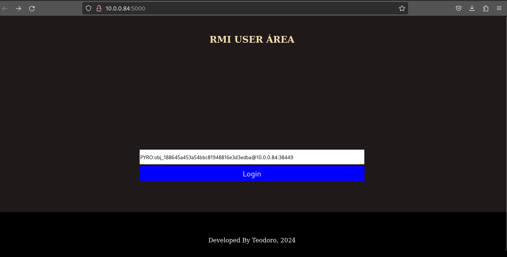
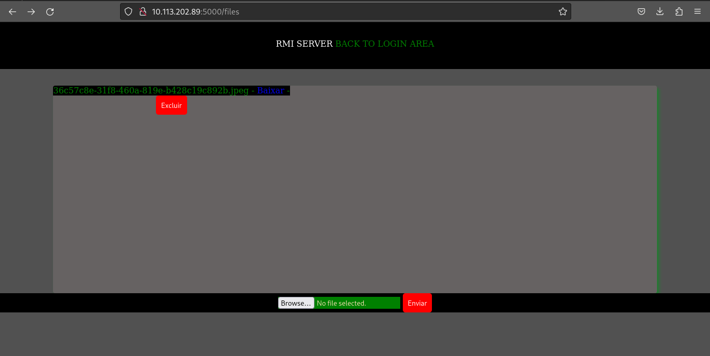

# RMI SERVER 🗄️

### O seguinte projeto é sobre: Servidor RMI feito em Python utilizando a biblioteca Pyro5 - Api em Flask que utiliza o URI gerado pelo servidor para ter acesso remoto ao diretório e arquivos da pasta setada.
----

## 🛠️ Tecnologias utilizadas

<code></code>

<code></code>

<code></code>

<code></code>

<code></code>

----

## 💻 Como utilizar o sistema
Clone este repositório, veja se há em seu computador todos os itens listados no requirements.txt, abra a pasta server e execute o arquivo `app.py` com o comando 
`python app.py` ou `python3 app.py`, em caso de Linux , veja o terminal ou console do seu computador:  
##### :exclamation:Importante *copie a uri gerada*

---
#### Parte 2:
#### Entre  na pasta `src` e execute o arquivo `app.py` com as mesmas orientações anteriores, visite a url gerada e faça login na interface passando a uri gerada pelo servidor; após logar, o usuário terá opções de download, upload, deleção e visualização de arquivos.
----
## Layout

----
## </> Desenvolvedor 
[Adelson Teodoro](https://github.com/imrooteodoro)

